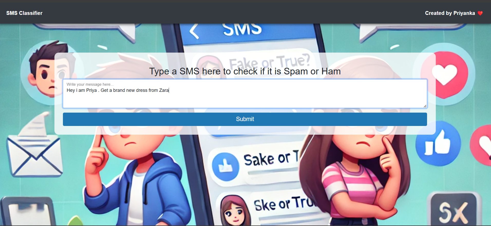
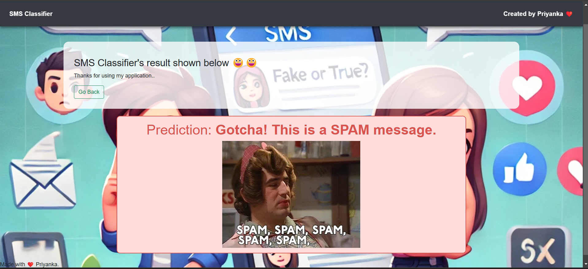

# 🚀 SMS Classification Project - Machine Learning

Welcome to the **SMS Classification** project! This project uses **Machine Learning (ML)** to classify SMS messages as either **Spam** or **Not Spam**. It uses natural language processing (NLP) techniques and a machine learning model to predict the category of a given SMS based on its content. The goal of this project is to help automate the detection of spam messages, which is crucial for reducing unwanted communications.

---

## 🖼️ **Before and After Prediction**

### **Before Prediction:**
Here is an example of an SMS before it has been classified:


### **After Prediction:**
Here is the result after the prediction is made, where the message has been classified as either **Spam** or **Not Spam**:


---

## 📊 **How It Works**

The **SMS Classification Model** is built using the following steps:

### 1. **Data Preprocessing**:
   - Cleaning the dataset by removing stop words, punctuation, and performing tokenization.
   - Transforming the text into numerical vectors using **TF-IDF (Term Frequency-Inverse Document Frequency)**.
   
### 2. **Model Selection**:
   - Using a machine learning algorithm such as **Naive Bayes** or **Logistic Regression** for text classification.
   
### 3. **Model Training**:
   - Splitting the dataset into training and testing data.
   - Training the model using the training data.

### 4. **Prediction**:
   - The trained model is used to classify incoming SMS messages as either **Spam** or **Not Spam**.

---

## ⚙️ **Technologies Used**

- **Python**: Programming language used for model implementation.
- **scikit-learn**: For machine learning algorithms and model evaluation.
- **Natural Language Processing (NLP)**: For text preprocessing and vectorization.
- **TF-IDF**: Used for transforming the text data into numerical features.
- **Matplotlib/Seaborn**: For visualization.
- **Jupyter Notebook**: For running and testing the ML models interactively.

---

## 🛠️ **How to Run the Project**

### Step 1: Clone this repository
```bash
git clone https://github.com/your-username/sms-classification 


